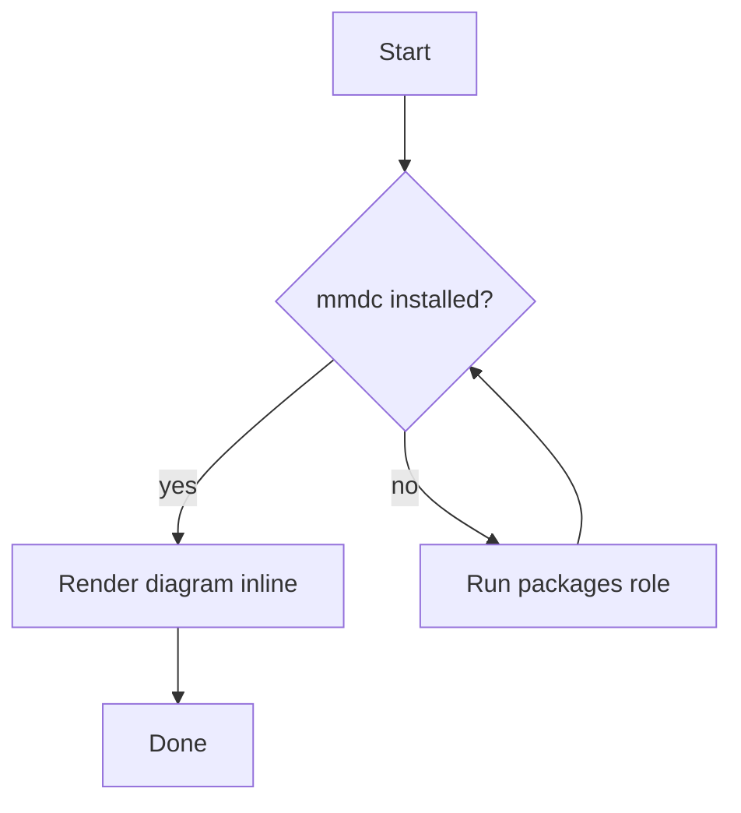

# Mermaid sample

Open this file in nvim (running directly in kitty) to verify the
`diagram.nvim` + `image.nvim` setup renders mermaid blocks inline.

```mermaid
flowchart TD
    A[Start] --> B{mmdc installed?}
    B -- yes --> C[Render diagram inline]
    B -- no --> D[Run packages role]
    D --> B
    C --> E[Done]
```
